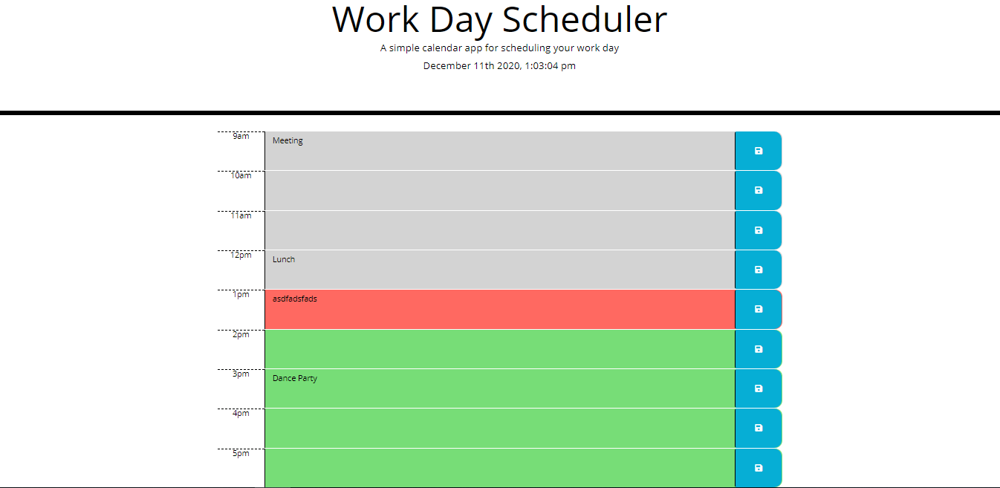

# Work-Day-Scheduler

## Project Description
This is a project that allows the user to add events to a calendar. This calendar is made for the work day and holds regular working hours, 9am to 5pm. The user can save their event to local storage by clicking the save button on the right of each column. Each row is color coded depending on the time of day; grey corresponds to the past, red corresponds to the present, and green corresponds to the future. 

## Mock Up

## Deployment
Link to website:
[Web App Link](https://ccsxw6.github.io/Work-Day-Scheduler/)

## Technologies Used
- HTML
- CSS (Bootstrap)
- JavaScript
- Moment.js
- Local Storage

